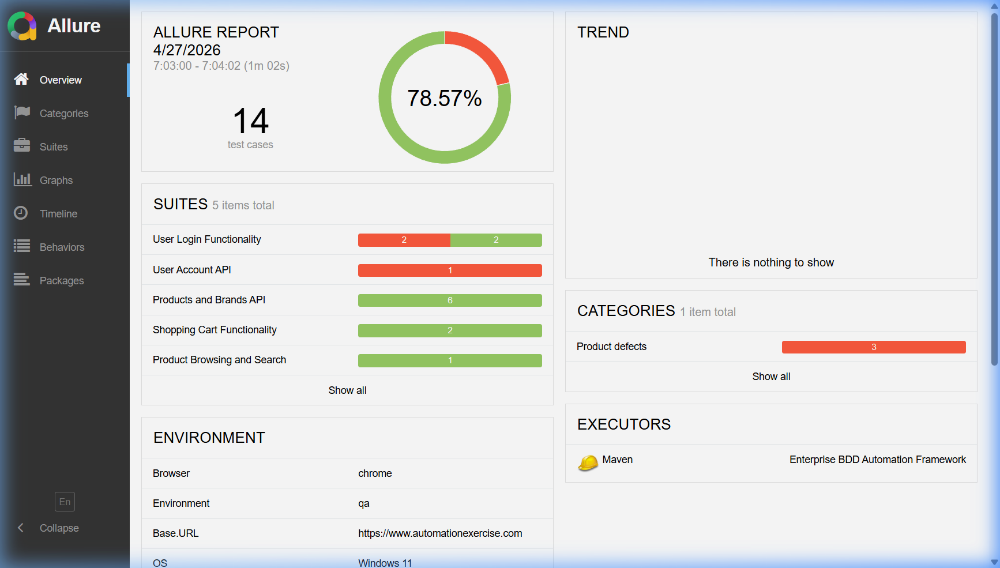
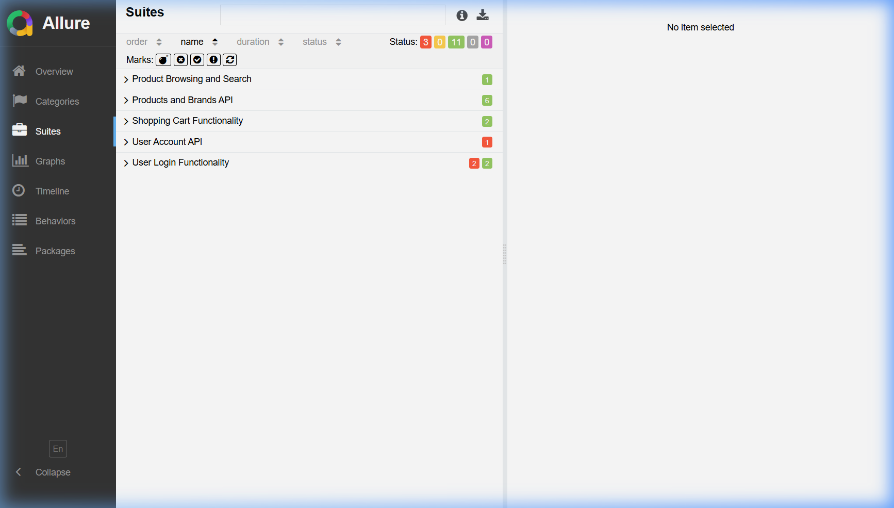
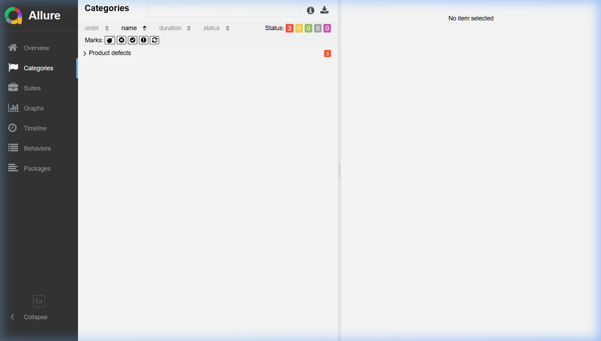
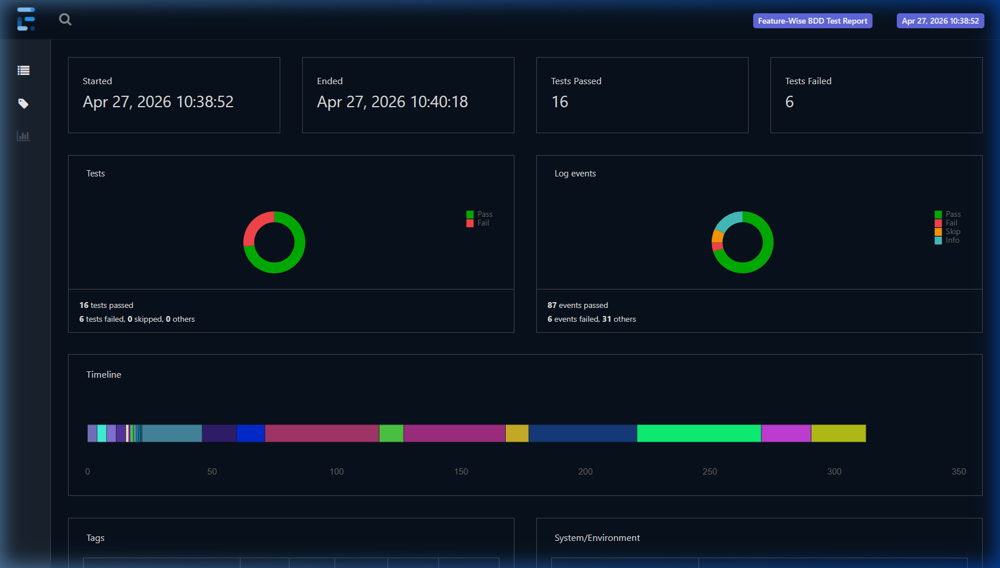
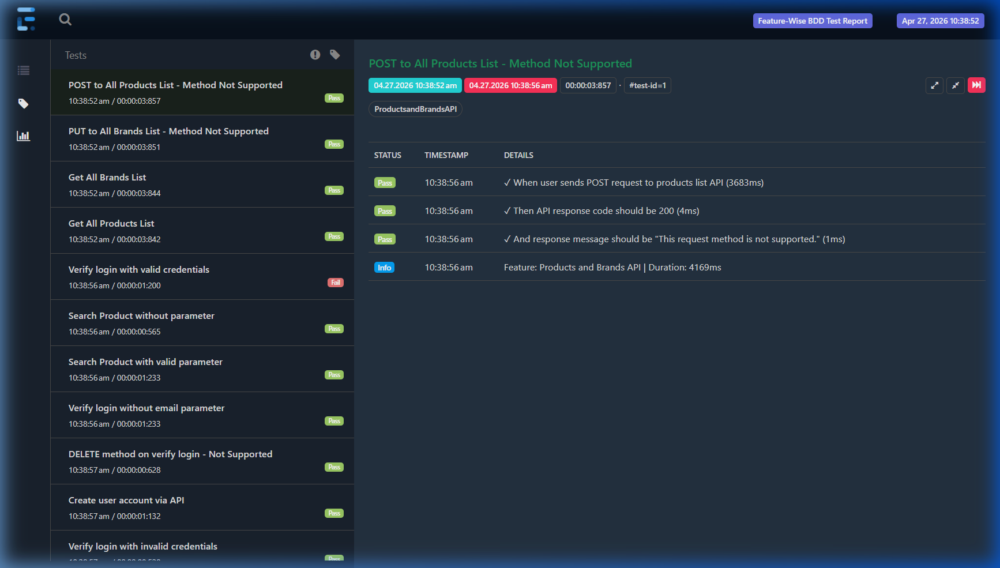
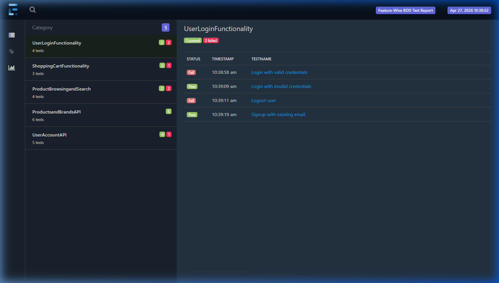
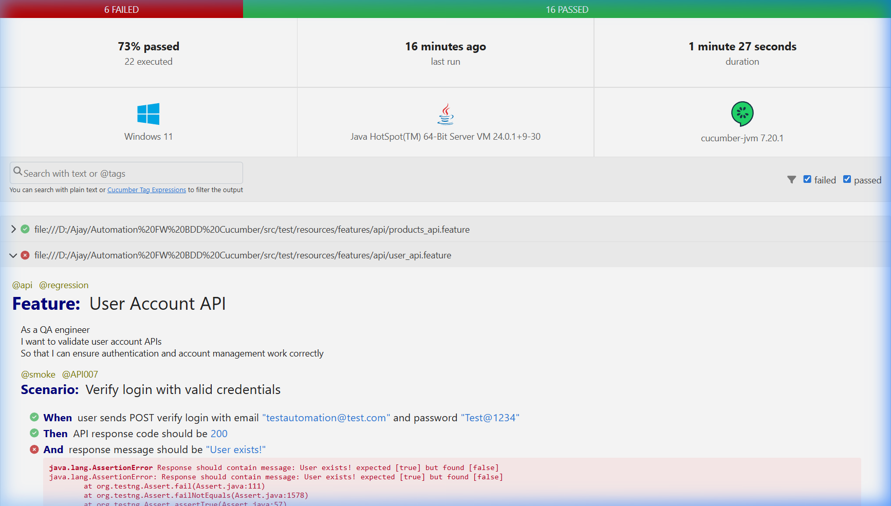

<div align="center">

# 🚀 Enterprise BDD Automation Framework

### Hybrid UI + API Testing | Cucumber BDD | TestNG | Multi-Layer Reporting

[](https://openjdk.org/)
[](https://www.selenium.dev/)
[](https://cucumber.io/)
[](https://testng.org/)
[](https://rest-assured.io/)
[](https://allurereport.org/)

</div>

---

## 📋 Table of Contents

- [Architecture Overview](#architecture-overview)
- [Tech Stack](#tech-stack)
- [Project Structure](#project-structure)
- [Getting Started](#getting-started)
- [Running Tests](#running-tests)
- [Reporting Dashboard](#reporting-dashboard)
  - [Allure Report (Primary)](#1-allure-report-primary-dashboard)
  - [Extent Report (Secondary)](#2-extent-report-secondary-dashboard)
  - [Cucumber Report (Baseline)](#3-cucumber-report-baseline)
- [CI/CD Pipeline](#cicd-pipeline)
- [Advanced Features](#advanced-features)

---

## 🏗️ Architecture Overview

```
┌──────────────────────────────────────────────────────────────┐
│                    TEST LAYER (BDD)                          │
│  ┌─────────────┐  ┌──────────────┐  ┌─────────────────────┐  │
│  │   Feature   │  │     Step     │  │      Runners        │  │
│  │    Files    │──│  Definitions │──│  (TestNG Parallel)  │  │
│  └─────────────┘  └──────────────┘  └─────────────────────┘  │
├──────────────────────────────────────────────────────────────┤
│                  FRAMEWORK LAYER                             │
│  ┌────────────┐  ┌────────────┐  ┌──────────────────┐        │
│  │    Pages   │  │ API Client │  │      Hooks       │        │
│  │   (POM)    │  │(REST Asrd) │  │ (Before/After)   │        │
│  └────────────┘  └────────────┘  └──────────────────┘        │
├──────────────────────────────────────────────────────────────┤
│                    CORE LAYER                                │
│  ┌────────────┐  ┌────────────┐  ┌──────────────────┐        │
│  │  Driver    │  │   Config   │  │    Utilities     │        │
│  │  Factory   │  │   Reader   │  │  (Screenshot,    │        │
│  │(ThreadLocal│  │ (Env-based)│  │   Retry, History │        │
│  └────────────┘  └────────────┘  └──────────────────┘        │
├──────────────────────────────────────────────────────────────┤
│                  REPORTING LAYER                             │
│  ┌──────────┐  ┌───────────┐  ┌──────────────────────────┐   │
│  │ Allure   │  │  Extent   │  │   Cucumber HTML/JSON     │   │
│  │(Primary) │  │(Secondary)│  │     (Baseline)           │   │
│  └──────────┘  └───────────┘  └──────────────────────────┘   │
└──────────────────────────────────────────────────────────────┘
```

---

## 🛠️ Tech Stack

| Component        | Technology            | Version |
|------------------|-----------------------|---------|
| Language         | Java                  | 17      |
| UI Automation    | Selenium WebDriver    | 4.27    |
| BDD Framework    | Cucumber              | 7.20    |
| Test Runner      | TestNG                | 7.10    |
| API Testing      | REST Assured          | 5.5     |
| Build Tool       | Maven                 | 3.9+    |
| DI Container     | PicoContainer         | 2.15    |
| Primary Report   | Allure Report         | 2.29    |
| Secondary Report | Extent Reports        | 5.1     |
| Logging          | Log4j2                | 2.24    |
| CI/CD            | GitHub Actions        | —       |

---

## 📂 Project Structure

```
Automation FW BDD Cucumber/
├── 📄 pom.xml                          # Maven build config
├── 📄 .gitignore
├── 📁 .github/workflows/
│   └── test-automation.yml             # CI/CD pipeline
│
├── 📁 src/main/java/com/automation/framework/
│   ├── 📁 config/
│   │   └── ConfigReader.java           # Environment config loader
│   ├── 📁 driver/
│   │   └── DriverFactory.java          # ThreadLocal WebDriver
│   ├── 📁 pages/
│   │   ├── BasePage.java               # Reusable page methods
│   │   ├── HomePage.java               # Home page actions
│   │   ├── LoginPage.java              # Login/Signup page
│   │   ├── SignupPage.java             # Registration form
│   │   ├── ProductsPage.java           # Products & search
│   │   └── CartPage.java               # Shopping cart
│   ├── 📁 api/
│   │   └── ApiClient.java              # REST Assured client
│   ├── 📁 reporting/
│   │   ├── FeatureCategoryPlugin.java  # Feature-wise Extent reporting
│   │   └── FeatureWiseReportGenerator.java
│   └── 📁 utils/
│       ├── ScreenshotUtil.java         # Screenshot capture
│       ├── RetryAnalyzer.java          # Flaky test retry
│       ├── AllureHistoryManager.java   # History & trend tracking
│       └── ExecutionTracker.java       # Execution analytics
│
├── 📁 src/test/java/com/automation/tests/
│   ├── 📁 hooks/
│   │   └── Hooks.java                  # Cucumber lifecycle hooks
│   ├── 📁 stepdefinitions/
│   │   ├── LoginSteps.java
│   │   ├── ProductSteps.java
│   │   ├── CartSteps.java
│   │   ├── ApiSteps.java
│   │   └── CommonSteps.java
│   └── 📁 runners/
│       ├── TestRunner.java             # All tests (parallel)
│       ├── SmokeTestRunner.java        # @smoke only
│       ├── RegressionTestRunner.java   # @regression only
│       └── ApiTestRunner.java          # @api only
│
├── 📁 src/test/resources/
│   ├── 📁 features/
│   │   ├── 📁 ui/
│   │   │   ├── login.feature
│   │   │   ├── products.feature
│   │   │   └── cart.feature
│   │   └── 📁 api/
│   │       ├── products_api.feature
│   │       └── user_api.feature
│   ├── 📁 config/
│   │   ├── dev.properties
│   │   ├── qa.properties
│   │   └── prod.properties
│   ├── testng.xml                      # Full suite
│   ├── testng-smoke.xml
│   ├── testng-regression.xml
│   ├── testng-api.xml
│   ├── allure.properties
│   ├── extent.properties
│   ├── extent-config.xml
│   └── log4j2.xml
│
├── 📁 docs/screenshots/               # Report screenshots
├── 📁 allure-results/history/          # Trend history
├── 📁 reports/                         # Generated reports
└── 📁 logs/                            # Execution logs
```

---

## 🚀 Getting Started

### Prerequisites

- **Java JDK 17+**: [Download](https://adoptium.net/)
- **Maven 3.9+**: [Download](https://maven.apache.org/download.cgi)
- **Allure CLI** (for local reports): [Install](https://allurereport.org/docs/install/)
- **Chrome / Firefox / Edge** browser

### Installation

```bash
# Clone the repository
git clone <your-repo-url>
cd "Automation FW BDD Cucumber"

# Install dependencies
mvn clean install -DskipTests

# Verify setup
mvn compile
```

### Install Allure CLI (Windows)

```powershell
# Using Scoop
scoop install allure

# Or using Chocolatey
choco install allure
```

---

## 🧪 Running Tests

### Run All Tests
```bash
mvn clean test
```

### Run by Tag
```bash
# Smoke tests only
mvn clean test -P smoke

# Regression tests only
mvn clean test -P regression

# API tests only
mvn clean test -P api
```

### Run with Options
```bash
# Specific environment
mvn clean test -Denv=qa -Dbrowser=chrome -Dheadless=true

# Firefox headless
mvn clean test -Dbrowser=firefox -Dheadless=true

# Custom tags
mvn clean test -Dcucumber.filter.tags="@smoke and @ui"
```

### Parallel Execution
```bash
# 4 parallel threads (default)
mvn clean test -Ddataproviderthreadcount=4

# 8 parallel threads
mvn clean test -Ddataproviderthreadcount=8
```

---

## 📊 Reporting Dashboard

This framework features a **multi-layer reporting ecosystem** with three integrated report types, providing comprehensive visibility into test execution at every level.

### 1. Allure Report (Primary Dashboard)

Allure provides the richest reporting experience with interactive dashboards, environment metadata, suite-level breakdowns, defect categorization, and historical trend analysis.

```bash
# Generate and open Allure report in browser
mvn allure:serve

# Or generate report files only
mvn allure:report
```

#### 📸 Allure Dashboard — Overview

The main dashboard displays pass rate, suite-wise execution summary, environment details (browser, OS, base URL), defect categories, and historical trends.

<div align="center">

</div>

**Key highlights:**
- **78.57% pass rate** across 14 test cases
- **5 suites** broken down by feature (User Login, Products API, Shopping Cart, etc.)
- **Environment block** showing browser, environment (QA), base URL, OS, and Java version
- **Categories** identifying product defects vs infrastructure failures

#### 📸 Allure Suites — Feature-Wise Breakdown

The Suites view groups all test cases by their parent feature, showing pass/fail counts per suite with color-coded bars.

<div align="center">

</div>

**Suites displayed:**
| Suite | Tests | Status |
|-------|-------|--------|
| Product Browsing and Search | 1 | ✅ |
| Products and Brands API | 6 | ✅ All passed |
| Shopping Cart Functionality | 2 | ✅ |
| User Account API | 1 | ❌ Failed |
| User Login Functionality | 4 | ⚠️ 2 passed, 2 failed |

#### 📸 Allure Categories — Defect Classification

The Categories view classifies test failures into actionable groups (Product Defects, Infrastructure Issues, Flaky Tests), making it easy to triage failures.

<div align="center">

</div>

---

### 2. Extent Report (Secondary Dashboard)

The Extent Spark Report is a dark-themed HTML dashboard with **feature-wise categorization** (not tag-wise). It provides pie charts, execution timeline, and step-level details for each scenario.

Report generated at: `reports/extent-report/SparkReport.html`

#### 📸 Extent Dashboard — Test Summary

The dashboard view shows overall pass/fail distribution, log event analysis, execution timeline, and system/environment information at a glance.

<div align="center">

</div>

**Dashboard features:**
- **Pass/Fail donut charts** — tests and log events
- **Execution timeline** — parallel execution visualization showing tests running across threads
- **Tags & System/Environment** sections for metadata

#### 📸 Extent Tests — Scenario-Level Details

The Tests view lists every scenario with its duration, pass/fail badge, and expandable step-level details showing Gherkin keywords (Given/When/Then) with timing.

<div align="center">

</div>

**Each test shows:**
- ✅ Step name with Gherkin keyword (When/Then/And)
- ⏱️ Duration per step in milliseconds
- 🏷️ Feature category badge (e.g., ProductsandBrandsAPI)
- ❌ Error messages on failure with stack traces

#### 📸 Extent Category — Feature-Wise Statistics

The **Category view groups tests by feature name** instead of tags. This provides a clear, functional overview of which features are healthy and which need attention.

<div align="center">

</div>

**Feature-wise breakdown:**
| Feature | Tests | Passed | Failed |
|---------|-------|--------|--------|
| User Login Functionality | 4 | 2 | 2 |
| Shopping Cart Functionality | 3 | 2 | 1 |
| Product Browsing and Search | 4 | 2 | 2 |
| Products and Brands API | 6 | 6 | 0 |
| User Account API | 5 | 4 | 1 |

> **Note:** Feature-wise categorization is powered by a custom `FeatureCategoryPlugin` that assigns feature names (not tags) as categories in the Extent Report.

---

### 3. Cucumber Report (Baseline)

The built-in Cucumber HTML report provides a clean, searchable view of all features and scenarios with full Gherkin step details and failure stack traces.

Report generated at: `target/cucumber-reports/cucumber.html`

#### 📸 Cucumber HTML Report

<div align="center">

</div>

**Report highlights:**
- **Pass/Fail bar** with color-coded status (red for failed, green for passed)
- **Environment info** — OS (Windows 11), Java version, Cucumber version
- **Feature-level grouping** with collapsible scenarios
- **Full error traces** with highlighted assertion failures
- **Search & filter** by text or `@tag` expressions

---

### Report Comparison

| Feature | Allure | Extent | Cucumber |
|---------|--------|--------|----------|
| Interactive Dashboard | ✅ Rich | ✅ Dark-themed | ❌ Basic |
| Feature-Wise Categories | ✅ Suites | ✅ Custom Plugin | ✅ Built-in |
| Step-Level Details | ✅ | ✅ With timing | ✅ With errors |
| Screenshot Attachments | ✅ | ✅ | ✅ |
| Historical Trends | ✅ Across builds | ❌ | ❌ |
| Environment Metadata | ✅ | ✅ | ✅ |
| Parallel Execution Timeline | ✅ | ✅ | ❌ |
| Defect Classification | ✅ Categories | ❌ | ❌ |
| Offline Mode | ❌ Needs CLI | ✅ Self-contained | ✅ Self-contained |

### Allure History & Trends

The framework automatically preserves Allure history for trend tracking across builds:

```
allure-results/
└── history/              ← Previous run history
    ├── history.json
    ├── history-trend.json
    ├── duration-trend.json
    ├── categories-trend.json
    └── retry-trend.json
```

**How it works:**
1. Before each run, `AllureHistoryManager.preserveHistory()` copies `allure-report/history/` → `allure-results/history/`
2. Allure merges this with current results during report generation
3. The resulting report shows pass/fail trends, duration trends, and category trends across builds

---

## 🔄 CI/CD Pipeline

### GitHub Actions Workflow

The pipeline automatically:
1. ☕ Sets up Java 17 + browser
2. 📦 Downloads previous Allure history (for trend charts)
3. 🧪 Runs tests in parallel (configurable thread count)
4. 📊 Generates Allure report with historical trends
5. 💾 Saves history artifact for next run
6. 📤 Uploads all reports (Allure + Extent + Cucumber) as artifacts
7. 🌐 Deploys Allure report to GitHub Pages (on `main` branch)
8. 🔔 Sends Slack notification on failure

### Manual Trigger

The workflow supports `workflow_dispatch` with configurable inputs:
- **Environment**: dev / qa / prod
- **Browser**: chrome / firefox / edge
- **Cucumber tags**: e.g., `@smoke`, `@api`, `@regression`
- **Headless mode**: true / false

### GitHub Pages

After merge to `main`, the Allure report is auto-deployed to:
```
https://<username>.github.io/<repo-name>/
```

---

## ⚡ Advanced Features

### Thread-Safe Driver (ThreadLocal)
```java
// Automatic per-thread driver management
DriverFactory.initDriver();    // Creates for current thread
DriverFactory.getDriver();     // Gets thread's driver
DriverFactory.quitDriver();    // Quits and cleans up
```

### Retry Mechanism
Tests that fail are automatically retried up to 2 times. Flaky tests are categorized in Allure reports under "Flaky Tests".

### Environment-Based Config
```bash
mvn test -Denv=qa      # Uses qa.properties
mvn test -Denv=prod    # Uses prod.properties
```

### Tag-Based Execution
| Tag          | Description                  |
|--------------|------------------------------|
| `@smoke`     | Quick validation tests       |
| `@regression`| Full regression suite        |
| `@ui`        | UI tests (needs browser)     |
| `@api`       | API tests (no browser)       |

### API Tests Without Browser
API scenarios tagged with `@api` skip WebDriver initialization entirely, making them fast and lightweight.

### Feature-Wise Reporting
The custom `FeatureCategoryPlugin` assigns feature file names as categories in Extent Reports, replacing the default tag-based grouping. This provides a cleaner, more meaningful view in the Category tab.

---

## 📧 Contact

Built with ❤️ for enterprise-grade test automation.
